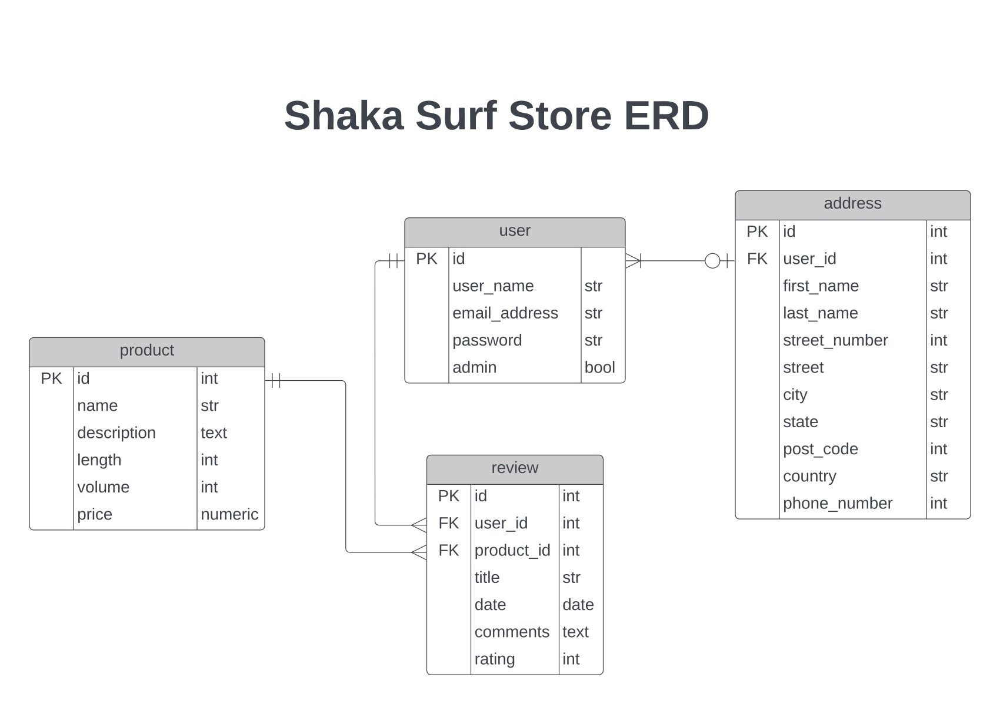
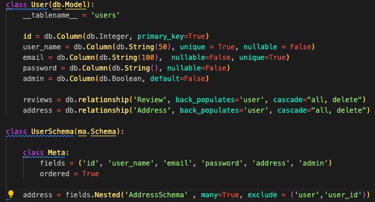
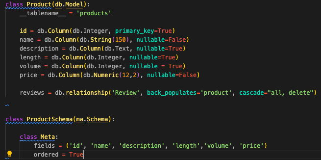
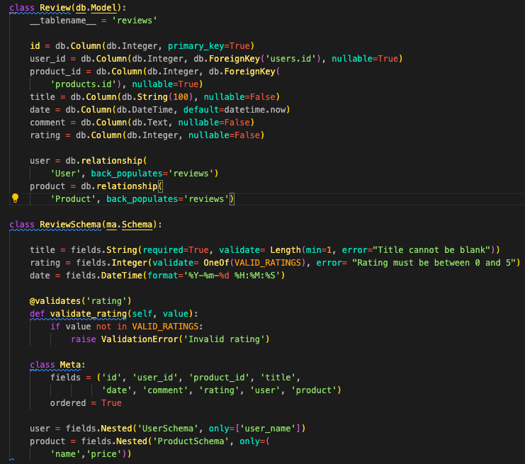
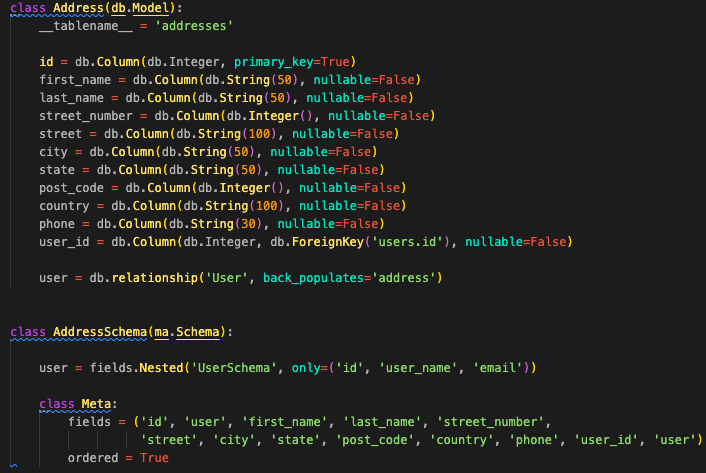
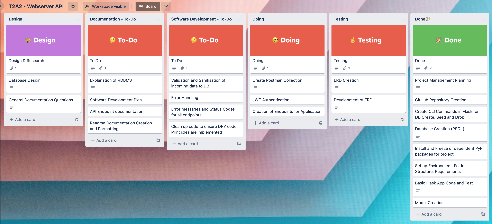

# T2A2 - API Webserver Project


## Adam Tunchay

### Student Number - 13537

### WDA2022-02
---

## Links
### [GitHub Repository](https://github.com/ad0maa/T2A2-webserver-api)
### [Trello Board](https://trello.com/invite/b/KS1u50IK/ATTI25b5bbadd6e63e974d5165818f22cfd4DB43F69C/t2a2-webserver-api)
### [Postman Endpoint Documentation and Template Request Collection](https://documenter.getpostman.com/view/23778116/2s8YerLXCQ)
---

## Installation and Testing

### Installation

In order to get the database set up and the flask server running there are a few instructions you must first follow.

1. Navigate to the /src directory of the project and run the following commands to install the required dependencies:

- ```python3 -m venv .venv```  (This creates a virtual environment for you to run the program)
- ```source .venv/bin/activate```   (This activates the virtual environment)
- ```pip install -r requirements.txt```  (This installs the required dependencies)

2. Once the dependencies have been installed, you will need to create a .env file in the /src directory of the project. This file will contain the following variables:

- ```FLASK_APP=app.py```
- 

### Testing

It is recommended to import the Postman collection to test the API endpoints once you have the database set up and flask server running. The Postman collection can be found - [Here](https://documenter.getpostman.com/view/23778116/2s8YerLXCQ).

In the top right corner of the link you can select 'Run in Postman' to import the collection into your Postman application. Once imported you may run the templates requests created by the developer, alternatively you can create your own requests to test the API endpoints.

---

## Shaka Surf Store eCommerce API

> ### R1 - Identification of the problem you are trying to solve by building this particular app.
<br>
After runnning a successful retail store on the Surfcoast, Victoria for the past 10 years, Shaka Surf Store is looking to expand their business via the creation of an online store. They see the potential and popularity of online shopping and have approached me to create an API Webserver that will handle the database for the website and provide accurate and secure data to the front end developers working on the website's front end build.

When talking about the project, Shaka Surf Store have specified that the API should be able to handle the follow:

- Allow users (customers) to register and login to the website securely
- Store customer's contact details
- Allow users to search products within the webstore via different parameters
- Allow the admins (Shaka staff) to add and remove products from the online store
- Allow users to review products within the store


> ### R2 Why is it a problem that needs solving?

As Shaka Surf have never had an online store previously the project's entire mission is to fill this gap in their business and provide them with the ability to sell their products online to potentially bring in revenue from markets they previously could not reach. They have a team of front end developers designing the store's website currently and have come to my team to create the backend infrastructure so they can have a working database for all of their products and users.

> ### R3 Why have you chosen this database system. What are the drawbacks compared to others?

PostgreSQL is the chosen database system for this project. PSQL has been selected because of how well it integrates with Python and Flask web framework as well as associated packages that are utilised in this project. It is a lightweight DBMS but come packed with features that are more than enough for a smaller application like this webstore and provides scalability if the application was to grow. It allows the developers to provide a secure environment through use of user and password authentication between the flask server and the database.

Another deciding factor was the fact that PSQL is open source and 100% free, which means a smaller project like this won't have it's budget blown out on licensing for software and more time and money can be spent developing the application itself.

Drawbacks of PSQL could be the fact that it's not as widely used as a DBMS such as mySQL so if the project was to be outsourced to other developers they may need to learn how to run this particular DBMS. Lastly, performance wise, PSQL is not as fast as other DBMS such as MySQL, but this performance drop generally comes into play when dealing with large amounts of data which shouldn't be an issue for an online store of this size.

> ### R4 Identify and discuss the key functionalities and benefits of an ORM

ORM (Object Relational Mapping) allows developers to write code in an object-oriented programming language (Python for this project) and have it automatically translate into SQL code that can be run on a relational database management system (PSQL here). This means that sql queries do not need to be written in their usual syntax but instead in more of a pythonic/programming like language. This creates cleaner code, as it reduces the amount of lines necessary to perform particular queries by abstracting majority of a usual SQL query and having it performed in the background rather than typed out in long form. This generally means less time spent dealing with database queries and more time concentrating on other elements of the application. 

> ### R5 Document all endpoints for your API

All endpoints have been documentated in detail and are hosted live through Postman at this link - [Postman Endpoint Documentation and Template Request Collection](https://documenter.getpostman.com/view/23778116/2s8YerLXCQ).

This documentation includes a description of the endpoint, the request type, the parameters required, the response type and the response body. It also includes a template request collection that can be imported into Postman to test the endpoints (recommended). To import the collection, click the "Run in Postman" button top right of the documentation page and follow the instructions. You may modify requests in the collection to test other parameters and responses.

The documentation is publicly available, but if you have trouble accessing it at that link, an export in PDF format (unfortunately some formatting is lost in conversion) can be downloaded from local file 
[PDF Export of Endpoint Documentation](./docs/api_documentation.pdf).

> ### R6 An ERD for your app


<br><br>

> ### R7 Detail any third party services/packages that your app will use

[BCrypt](https://pypi.org/project/bcrypt/) - Used to hash passwords before they are stored in the database. This provides security so that that passwords are not stored in plain text.

[Flask](https://pypi.org/project/Flask/) - Flask is the webserver framework used in this project and handles the API endpoints.

[Flask-SQLAlchemy](https://pypi.org/project/flask-sqlalchemy/) - Flask-SQLAlchemy is an extension for Flask that adds support for SQLAlchemy within Flask.

[Flask-Marshmallow](https://pypi.org/project/flask-marshmallow/) - Flask-Marshmallow is an extension for Flask that adds support for Marshmallow.

[Flask-JWT-Extended](https://pypi.org/project/Flask-JWT-Extended/) - Flask-JWT-Extended is an extension for Flask that adds support for JSON Web Tokens for authentication.

[SQLAlchemy](https://pypi.org/project/SQLAlchemy/) - SQLAlchemy is the ORM used in this project. It allows for SQL queries to be written in python-like code rather than regular SQL language and is automatically translated for the DBMS (PostgreSQL).

[Marshmallow](https://pypi.org/project/marshmallow/) - Marshmallow is a package that allows for the serialization and deserialization of data.

[psychopg2](https://pypi.org/project/psycopg2/) - psychopg2 is a package that allows for the connection between the Flask webserver and the PostgreSQL database.

[python-dotenv](https://pypi.org/project/python-dotenv/)- python-dotenv is a package that allows for the use of .env files to store the API keys.

[PostgreSQL](https://www.postgresql.org/) - PostgreSQL is the DBMS used in this project.

[Postman](https://www.postman.com/) - Postman is the software used to test and document the API endpoints.

[Trello](https://trello.com/) - Trello is the software used to manage the project.


> ### R8 Describe your projects models in terms of the relationships they have with each other

### User Table


<br><br>

The user table is the table that stores all of the users of the webstore. It stores the id, user name, email address, password, and a boolean value that determines whether the user is an admin or not. The user table has a one to many relationship with the review table, as a user can have many reviews but a review can only have one user. The user table also links to the address table, as a user can have many addresses but an address can only have one user.

### Product Table



The product table is the table that stores all of the products that are available for sale on the webstore. It stores the id, product name, description, length, volume and price of each product. The product table has a one to many relationship with the review table, as a product can have many reviews but a review can only have one product.

### Review Table



The review table is the table that stores all of the reviews that have been made by users on the webstore. It stores the id, title, date, comment, rating of each review. It also stores the user id and product id as foreign keys for each review. The review table has a one to many relationship with the user table, as a user can have many reviews but a review can only have one user. It also features a relationship to the product table, a review is linked to one product, but a product can have many reviews.

### Address Table



The address table is the table that stores all of the addresses that have been added by users on the webstore. It stores the id, first name, last name, street number, street name, city, state, country and postcode of each address. It also stores the user id as a foreign key for each address. The address table has a one to many relationship with the user table, as a user can have many addresses but an address can only have one user.

> ### R9 Discuss the database relations to be implemented in your application

Within the application, relationships between the tables are implemented using foreign keys.
- The Review table features two foreign keys as it has a relationship to both the user table and the product table. The attributes that the review table is linked to are the user id and the product id. This means that when a review is created in the review table, the product id of product being reviewed is stored, as well as the user id of the currently logged in user.


- The Address table features user id as a foreign key from the user table. This means that when an address is created in the address table, the user id of the logged in user is stored with the address data. This allows for the address to be linked to the user that created it.


> ### R10 Describe the way tasks are allocated and tracked in your project
 
Project management for this project was handled through a kanban board on Trello. [Link to Trello Board](https://trello.com/invite/b/KS1u50IK/ATTI25b5bbadd6e63e974d5165818f22cfd4DB43F69C/t2a2-webserver-api). It allowed for breaking down the project into smaller sections to work through and track the progress as the application was developed. My workspace featured a Design, To-Do (Documentation), To-Do (Software Development), Doing, Testing and Done.

On the first day of planning, I broke down the elements from the assignment instructions page into smaller tasks and created cards for each of these tasks and filed them accordingly. The first step was the plan the database design and create an ERD for the database.


<br><br>

Once I had an idea of the database that was to be implemented, coding began and I created models and Schemas for each table in the database. Next step was to set up command line commands to drop, create and seed the database so I had working data entries during development.

Once the database was set up and appearing within PSQL, I began creating the endpoints required for the application. Blueprints were created for the relevant endpoints and then I used Postman to generate requests and test the endpoints.



Finally, the Endpoint Documentation was generated using Postman and all remaining documentation questions were answered and the project was submitted.


